</img> Strike Mission: Temple of Febe CM
=============================================================================================================================

</img> Squad Composition
-----------------------------------------------------------------------------------------------------------------------------
|           | Heal・Alacrity | Quickness | DPS | DPS | DPS |
|----------:|:-------------:|:---------:|:---:|:---:|:---:|
|  Group 1. |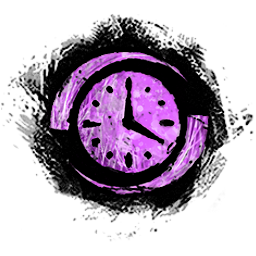</img> 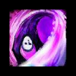</img> 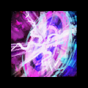</img> 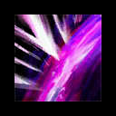</img>|</img> 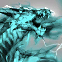</img> 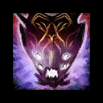</img>|</img> 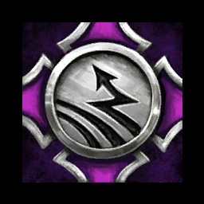</img>|</img> </img>|</img> </img>|
|  Group 2. |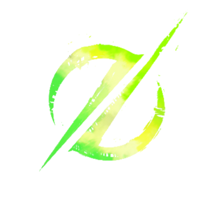</img> 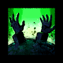</img> 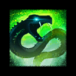</img> 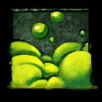</img>|</img> </img> </img>|</img> </img>|</img> </img>|</img> </img>|

</img> Commander Marker Position
---------------------------------------------------------------------------------------------------------------------------------------------
</img>

Strategy
--------
**Phase 1. Spawn aspect every 30sec (~80%)**

|</img> Squad |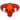</img> Cerus |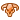</img> Aspects |</img></img> Portal |
|:--------:|:-----------------:|:-------:|:------:|
|</img>|
$\color{lime}{Regret}$
| |</img>|
|</img></img> drop dot|      Despair      |  Malice |</img></img></img>|
|Kill </img>|
$\color{magenta}{Envy}$
| | |
| | | |</img></img></img>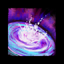</img>**３**|
| drop |
$\color{yellow}{Malice/Gluttony}$
| Despair | |
|</img>| | | |
|</img></img> Kill </img>| Rage | |</img></img></img>|
| | Regret | Envy | |
| drop | Despair | | |
|</img> Stack| Envy | | |

**Split 1. Kill Regret (３) / Cover Gluttony (９)**

**Phase 2. Spawn aspect every 20sec (~50%)**

|</img> Squad |</img> Cerus |</img> Aspects |</img></img> Portal |
|:-----:|:-----:|:-------:|:------:|
|</img></img>９| Regret | |</img></img></img>|
| drop９ | Despair | Rage | |
|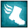</img>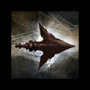</img>|
$\color{magenta}{Envy}$
| | |
| | Malice | Gluttony |</img></img></img></img>**３**|
|</img>| 
$\color{lime}{Gluttony}$
| Malice |</img></img></img>|
|</img></img> Kill </img>| Rage | | |
| double drop 12 | Regret | Despair | |
| | Despair | | |
|</img></img>|
$\color{magenta}{Envy}$
| | |
| Jump </img>| | Envy |</img></img></img></img>**７**|
| | Malice/Gluttony | Regret | |
|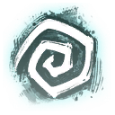</img></img> Kill| Rage | |</img></img></img>|
| | Regret | Rage | |

**Split 2. Kill Gluttony (９)**

**Phase 3. Spawn aspect every 15sec (~10%)**

|</img> Squad |</img> Cerus |</img> Aspects |</img></img> Portal |
|:-----:|:-----:|:-------:|:------:|
|</img>|
$\color{lime}{Regret}$
| |</img>|
|</img></img>| |
$\color{yellow}{Rage}$
|</img></img></img>|
|</img>🚫🔗️</img></img></img>️| Envy | | |
| | |
$\color{magenta}{Gluttony}$
|</img></img>|
| |
$\color{yellow}{Gluttony}$
|Malice|</img></img></img>|
|</img></img> Kill | Rage | | |
|DROP LINE 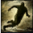</img>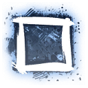</img></img>| Malice | Despair | |
|DROP DOT </img> Kill| Despair | | |
|Jump </img>| Regret | Envy | |
|</img></img>| Envy | Regret | |
| |
$\color{pink}{Gluttony}$
|
$\color{pink}{Rage}$
|１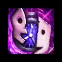</img></img></img></img>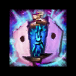</img></img>|
|</img> 12| | | |
|12 </img>|
$\color{yellow}{Rage}$
| |12 </img></img>🔗️️</img> 12 </img>|
|</img>| |
$\color{magenta}{Gluttony}$
| |
|</img></img> DROP EDGE </img></img></img>| Despair | Malice |</img></img></img>|
| Kill |
$\color{lime}{Regret}$
| |↖️</img></img></img></img>|
|DROP DOT 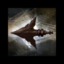</img></img></img>| | Despair | |
|</img></img>| Envy | | |
|</img> Jump９|
$\color{yellow}{Gluttony}$
| Envy | |
| ５ | |
$\color{lime}{Regret}$
| |
|５</img>|
$\color{yellow}{Rage}$
| |５</img>**５**🔗</img>**５**</img>|
|</img></img>| Malice |
$\color{yellow}{Rage}$
|</img></img></img>|
|
$\color{yellow}{DROP}$
| Despair | | |
|</img> Stack| Regret |
$\color{yellow}{Gluttony}$
| |
|</img></img>| Envy | Malice | |

**Phase 4. Spawn Aspect every 5sec (~0%)**

|</img> Squad |</img> Cerus |</img> Aspects |</img></img> Portal |
|:-----:|:-----:|:-------:|:------:|
|</img>| \<\<\<Enraged Smash\>\>\> | |</img>|
|</img></img> DROP DOT </img></img>| \<\<\<Enraged Smash\>\>\> | Despair |</img></img></img>|
|</img></img>| \<\<\<Enraged Smash\>\>\> | Envy | |
|</img>| \<\<\<Enraged Smash\>\>\> | Regret | |
| 6 (+Range 450) | \<\<\<Enraged Smash\>\>\> | Rage | |
|</img>| \<\<\<Enraged Smash\>\>\> |
$\color{magenta}{Gluttony}$
|</img></img>|
|</img></img>| \<\<\<Enraged Smash\>\>\> | Malice |</img></img></img></img>|
|DROP DOT </img></img>| \<\<\<Enraged Smash\>\>\> | Despair | |
|</img></img>| \<\<\<Enraged Smash\>\>\> | Envy | |
| | \<\<\<Enraged Smash\>\>\> | Regret | |
| 6 (+Range 450) | \<\<\<Enraged Smash\>\>\> | Rage | |
|</img>| \<\<\<Enraged Smash\>\>\> | Gluttony | |
| Win Or Die | Win Or Die | Win Or Die | Win Or Die |
