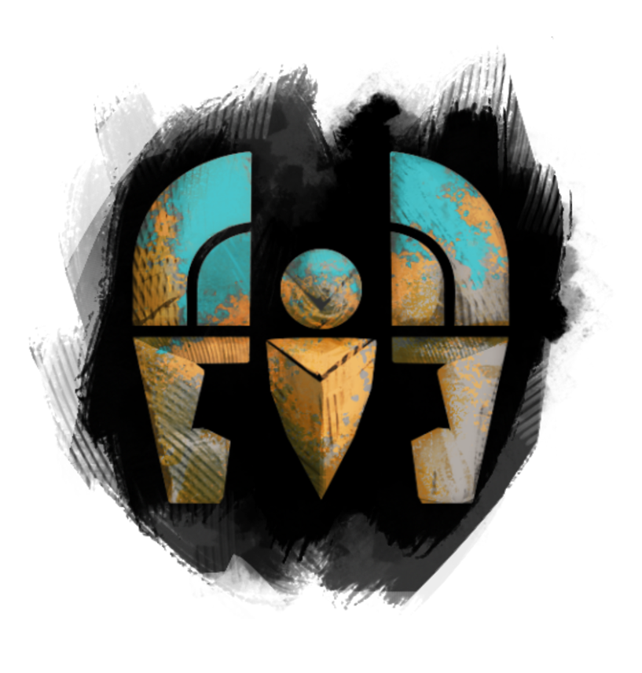

# </img> Strike Mission: Kaineng Overlook CM

## </img> Squad Composition
|           | Heal・Alacrity | Quickness | DPS | DPS | DPS |
|----------:|:--------------:|:---------:|:---:|:---:|:---:|
|  Group 1. |</img>|</img>|</img>|</img>|</img>|
|  Group 2. |</img>|</img>|</img>|</img>|</img>|

## Walkthrough

### Phase 1. Minister Li (~66%); Attack Patterns: ①②③(loop)
<table style="width: 100%;">
	<tbody>
		<tr>
			<td style="width: 20.0000%;">①
				 
			</td>
			<td style="width: 40.0442%;" colspan="2">
				 
			</td>
			<td style="width: 20.0000%;">$\color{orange}{Wave(Player)}$
				 
			</td>
			<td style="width: 20.0000%;">$\color{lime}{Green}$
				 
			</td>
		</tr>
		<tr>
			<td style="width: 20.0000%;">②
				 
			</td>
			<td style="width: 20.0000%;">$\color{skyblue}{Rush(Corner)}$
				 
			</td>
			<td style="width: 20.0000%;">➕
				 
			</td>
			<td style="width: 20.0000%;">$\color{orange}{Wave(Center)}$
				 
			</td>
			<td style="width: 20.0000%;">$\color{lime}{Green}$
				 
			</td>
		</tr>
		<tr>
			<td style="width: 20.0000%;">③
				 
			</td>
			<td style="width: 20.0000%;">$\color{skyblue}{Rush(Center)}$
				 
			</td>
			<td style="width: 20.0000%;">➕
				 
			</td>
			<td style="width: 40.0442%;" colspan="2">$\color{pink}{Numbers}$
				 
			</td>
		</tr>
	</tbody>
</table>

Mechanism Note

<table style="width: 100%;">
	<tbody>
		<tr>
			<td style="width: 50.0000%;">$\color{lime}{Green}$
				 
			</td>
			<td style="width: 50.0000%;">무작위 플레이어에게 천천히 줄어드는 AoE가 표시된다.
				 AoE가 종료될 때, <strong>최소 3명의 플레이어</strong>가 원 안에 있어야 한다.
				 처리에 실패할 경우 모든 플레이어는 큰 피해를 입는다.
				 
			</td>
		</tr>
		<tr>
			<td style="width: 50.0000%;">$\color{orange}{DragonSlash&mdash;Wave(DSW)}$
				 
			</td>
			<td style="width: 50.0000%;">&#39;Minister Li&#39;는 잠시 후 전방으로 큰 피해를 입히며, <strong>멀리 밀쳐내는 넓은 범위의 공격</strong>을 실행한다.
				 모든 플레이어는 &#39;Minister Li&#39;의 뒤에 위치하는 것으로 공격을 피할 수 있다.
				 
			</td>
		</tr>
		<tr>
			<td style="width: 50.0000%;">$\color{skyblue}{DragonSlash&mdash;Rush(DSR)}$
				 
			</td>
			<td style="width: 50.0000%;">&#39;Minister Li&#39;는 바라보고 있는 위치로 돌진하며, 이동경로에 위치한 플레이어들에게 큰 피해를 입힌다.
				 모든 플레이어는 &#39;Minister Li&#39;의 뒤에 위치하거나, 닷지로 공격을 피할 수 있다.
				 
			</td>
		</tr>
		<tr>
			<td style="width: 50.0000%;">$\color{pink}{DragonSlash&mdash;Burst(Numbers)}$
				 
			</td>
			<td style="width: 50.0000%;"><strong>5명의 플레이어</strong>의 머리 위에 로마 숫자(</img></img></img>) 형식의 1에서 5까지의 표식을 새긴다.
				 표식을 받은 플레이어는 화면에 노란색 테두리가 나타나며,
				 스쿼드 UI의 아이콘 테두리가 빨간색으로 표시된다. 이것은 모든 플레이어가 확인할 수 있다.
				 <strong>표식이 나타난 후, 8초 뒤</strong>에 &#39;Minister Li&#39;는 표식이 달린 플레이어에게 오름차순으로 원거리 웨이브를 날린다. 공격을 받은 플레이어는 3초간 </img><a href="https://wiki.guildwars2.com/wiki/Extreme_Vulnerability" target="_blank" rel="noopener noreferrer">Extreme Vulnerability</a> 효과를 받으며, 매우 짧은 시간이 경과한 후에 치명적인 피해량을 가진 작은 붉은 웅덩이를 남긴다.
				 <strong>붉은 웅덩이는 원거리 공격을 회피하더라도 나타난다.</strong>
				 
			</td>
		</tr>
	</tbody>
</table>

### Phase 2. Enforcer, Ritualist, and Mindblade
> [!NOTE]
> Kill Priority ①Mindblade ②Ritualist ③Enforcer

|General|
|:-|
|・'Mindblade'와 'Enforcer'는 처음 등장할 때, 가장 가까운 대상을 공격 대상으로 지정한다. ・한 명의 플레이어가 동시에 'Mindblade'와 'Enforcer'의 공격 대상으로 지정될 수 있다. ・'Mindblade'와 'Enforcer'는 서로 간의 거리가 360미만일 때, 서로를 연결하는 선이 나타나며 특수한 효과(0)를 얻는다.|
