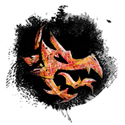

# </img> Strike Mission: Old Lion's Court CM

## </img> Squad Composition
|           | Heal・Alacrity | Quickness | DPS | DPS | DPS |
|----------:|:--------------:|:---------:|:---:|:---:|:---:|
|  Group 1. |</img> </img>/</img></img>/</img>|</img> </img>/</img></img>/</img>|</img> </img>Kite|</img>|</img>|
|  Group 2. |</img>|</img>|</img>|</img>|</img>|

 

## </img> Triple-Threat Puzzles
<table style="width: 100%;">
	<tbody>
		<tr>
			<td style="width: 25.0000%;">Who
				 
			</td>
			<td style="width: 25.0000%;">Where
				 
			</td>
			<td style="width: 25.0000%;">State
				 
			</td>
			<td style="width: 25.0000%;">CC Target
				 
			</td>
		</tr>
		<tr>
			<td style="width: 25.0000%;" rowspan="3"></img></td>
			<td style="width: 25.0000%;">Center
				 
			</td>
			<td style="width: 25.0000%;">
				 
			</td>
			<td style="width: 25.0000%;">$\color{pink}{Vermilion}$
		</tr>
		<tr>
			<td style="width: 25.0000%;" rowspan="2">Edge
				 
			</td>
			<td style="width: 25.0000%;">Look inside
				 
			</td>
			<td style="width: 25.0000%;">$\color{lime}{Arsenite}$
		</tr>
		<tr>
			<td style="width: 25.0000%;">Look outside
				 
			</td>
			<td style="width: 25.0000%;">$\color{skyblue}{Indigo}$
		</tr>
	</tbody>
</table>

 

## Common Mechanism Note
