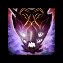
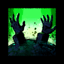

</img> Strike Mission: Temple of Febe CM
=============================================================================================================================

</img> Squad Composition
-----------------------------------------------------------------------------------------------------------------------------
|           | Heal・Alacrity | Quickness | DPS | DPS | DPS |
|----------:|:-------------:|:---------:|:---:|:---:|:---:|
|  Group 1. |</img> </img> </img> </img>|</img> </img> </img>|</img> </img>|</img> </img>|</img> </img>|
|  Group 2. |</img> </img> </img> </img>|</img> </img> </img>|</img> </img>|</img> </img>|</img> </img>|

</img> Commander Marker Position
---------------------------------------------------------------------------------------------------------------------------------------------
</img>

Strategy
--------
**Phase 1. Spawn aspect every 30sec (~80%)**

|</img> Squad |</img> Cerus |</img> Aspects |
|:--------:|:-----------------:|:-------:|
||||
||||
||||
||||
||||
||||
||||
||||
||||
||||
