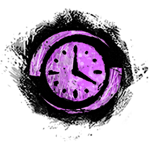
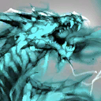
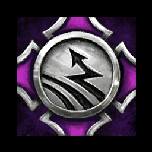
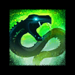
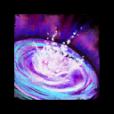
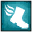
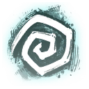

# </img> Strike Mission: Temple of Febe CM

## </img> Squad Composition
|           | Heal・Alacrity | Quickness | DPS | DPS | DPS |
|----------:|:-------------:|:---------:|:---:|:---:|:---:|
|  Group 1. |</img> </img> </img> </img>|</img> </img> </img>|</img> </img>|</img> </img>|</img> </img>|
|  Group 2. |</img> </img> </img> </img>|</img> </img> </img>|</img> </img>|</img> </img>|</img> </img>|

 

## </img> Commander Marker Position
</img>

 

## Strategy
> [!NOTE]
></img> Chronomancer Action
>
></img> Scourge Action
>
></img> Squad Action
>
>>Regret </img></img></img></img>... Do Scourge Action when Regret `End`, Sand Swell </img> to </img>
>>
>></img></img></img></img> Rage...... Do Scourge Action when Rage `Start`, Sand Swell </img> to </img>

### **Phase 1. Spawn aspect every 30sec (~80%)**

|</img> Squad |</img> Cerus |</img> Aspects |
|:--------:|:-----------------:|:-------:|
|</img>|Regret </img></img></img></img>||
|</img></img> drop dot|Despair|Malice|
|Kill </img>|Envy </img></img></img></img>**３**||
|drop|Malice & Gluttony </img>|Despair|
|</img></img>|||
|</img></img> Kill </img>|</img></img></img></img> Rage||
||Regret|Envy|
|drop|Despair||
|</img> Stack|Envy||

### **Split 1. Kill Regret (３) / Cover Gluttony (９)**

### **Phase 2. Spawn aspect every 20sec (~50%)**

|</img> Squad |</img> Cerus |</img> Aspects |
|:--------:|:-----------------:|:-------:|
|</img></img>９|</img></img></img></img> Regret||
|drop９|Despair|Rage|
|</img></img>|Envy </img></img></img></img>**３**||
||Malice|Gluttony|
|</img></img>|Gluttony </img></img></img></img>|Malice|
|</img></img> Kill </img>|Rage||
|double drop 12|Regret|Despair|
||Despair||
|</img></img>|Envy </img></img></img></img>**７**||
|Jump </img>||Envy|
||Malice & Gluttony|Regret|
|</img></img> Kill|</img></img></img></img> Rage||
||Regret|Rage|

### **Split 2. Kill Gluttony (９)**

### **Phase 3. Spawn aspect every 15sec (~10%)**

|</img> Squad |</img> Cerus |</img> Aspects |
|:--------:|:-----------------:|:-------:|
|</img>|Regret||
|</img></img>||</img></img></img></img> Rage </img>|
|</img></img></img></img>🔗️️</img></img>|Envy||
|||Gluttony </img></img></img>|
||Gluttony </img></img></img>|Malice|
|</img></img></img> Kill|</img> Rage||
|DROP LINE </img></img></img>|Malice|Despair|
|DROP DOT </img> Kill|Despair||
|Jump </img>|Regret|Envy|
|</img></img>|Envy|Regret|
||
$\color{pink}{Gluttony}$
|</img>１</img></img></img></img></img> Rage|
|</img> *12*|||
|*12* </img>|</img> 12 </img></img>🔗️</img> **12** </img> Rage </img>||
|</img></img>||Gluttony </img></img></img>|
|</img></img></img> DROP ARC </img></img></img>|Despair|Malice|
|Kill|Regret </img>↖️</img></img></img></img>||
|DROP DOT </img></img></img>||Despair|
|</img></img>|Envy||
|</img> Jump９|Gluttony </img>|Envy|
|</img>５||Regret </img>５</img>**５**🔗️️</img>**５**</img>|
|５</img>|Rage </img>||
|</img></img></img>|Malice|</img></img></img> Rage </img>|
|</img> DROP|Despair||
|</img></img> Stack|Regret|Gluttony </img>|
|</img></img>|Envy|Malice|

### **Phase 4. Spawn Aspect every 5sec (~0%)**

|</img> Squad |</img> Cerus |</img> Aspects |
|:--------:|:-----------------:|:-------:|
|</img>|\<\<\<Enraged Smash\>\>\>||
|</img></img></img> DROP DOT </img></img>|\<\<\< </img></img></img></img> \>\>\>|</img> Despair|
|</img></img>|\<\<\<Enraged Smash\>\>\>|Envy|
|</img>|\<\<\<Enraged Smash\>\>\>|Regret|
|6 (+Range 450)|\<\<\<Enraged Smash\>\>\>|Rage|
|</img>|\<\<\<Enraged Smash\>\>\>|</img></img></img> Gluttony </img></img></img></img>|
|</img></img></img>|\<\<\<Enraged Smash\>\>\>|Malice|
|DROP DOT </img></img>|\<\<\<Enraged Smash\>\>\>|Despair|
|</img></img>|\<\<\<Enraged Smash\>\>\>|Envy|
||\<\<\<Enraged Smash\>\>\>|Regret|
|6 (+Range 450)|\<\<\<Enraged Smash\>\>\>|Rage|
|</img>|\<\<\<Enraged Smash\>\>\>|Gluttony|
|Win Or Die|Win Or Die|Win Or Die|
