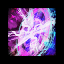
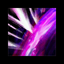
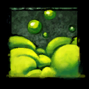

| **Squad** | Heal・Alacrity | Quickness | DPS | DPS | DPS |
|-----------|:--------------:|:---------:|:---:|:---:|:---:|
|  Group 1. |</img> </img> </img> </img>|</img> </img> </img>|</img> </img>|</img> </img>|</img> </img>|
|  Group 2. |</img> </img> </img> </img>|</img> </img> </img>|</img> </img>|</img> </img>|</img> </img>|

|</img> Commander Marker Setting |
|:--------------------------:|
|</img>|
 

*Phase 1. Spawn aspect every 30sec (~80%)*
| </img> Squad | </img> Cerus | </img> Aspects | </img></img> Portal |
|-------|-------|---------|--------|
|       |       |         |        |
|       |       |         |        |
|       |       |         |        |
|       |       |         |        |
|       |       |         |        |
|       |       |         |        |
|       |       |         |        |
|       |       |         |        |
|       |       |         |        |
|       |       |         |        |
